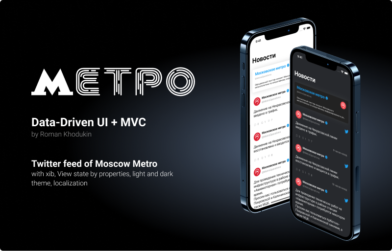

    

  
  
  
  
  

  
 ## Требования
 Реализовать новостной экран, который отображает ленту твиттера Московского метрополитена.
 Экран имеет 3 состояния: Загрузка, Ошибка и Отображение. В состоянии отображения 3 ячейки: статичная (информация о том, что это официальная информация из Твиттера), ячейка с картинкой и ячейка без картинки.
Необходимо реализовать: взаимодействие с сетью для скачивания информации + её отображение. По тапу на твит - открывать его в сафари контроллере.

Необходимо использовать:
- SwiftyJSON
- SDWebImage
- SwiftDate
- Data-driven UI + MVC
- UIKit
- AutoLayot + xibs
 
 ## Реализовано

- [x] Получение данных с помощью URLSession
- [x] Парсинг данных с использованием SwiftyJSON
- [x] Twitter-like отображние дат с помощью SwiftDate
- [x] Реализация экрана с помощью подхода Data-Driven UI
- [x] Обработка текста твитов с выделением ссылок на внешние ресурсы
- [x] Поддержка светлой и тёмной тем
- [x] Локализация на русский и английский языки

Экран реализован с помощью UITableView с 4 видами ячеек: 
- Загрузка твитов
- Ошибка при загрузке с возможностью сделать повторный запрос
- Твит с картинкой
- Твит без картинки

Также добавлен Header с информацией об официальном твиттер аккаунте метро. Все UI элементы выполнены в xib. DataSource и Delegate таблицы вынесены для ухода от Massive View Controller. 

## Демонстрация работы приложения

  

